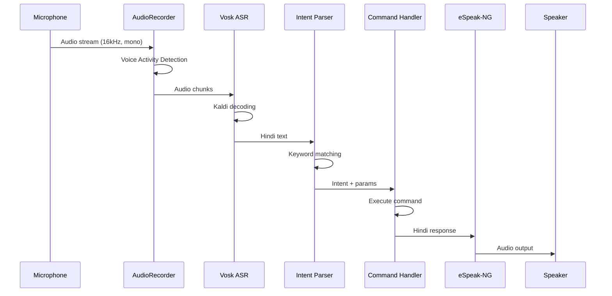

# Architecture Documentation

## System Overview

The Hindi Voice Assistant is designed as a modular, offline speech processing pipeline optimized for Arm-based single-board computers like Raspberry Pi.

## Component Architecture

```
┌─────────────────────────────────────────────────────────────────┐
│                      Voice Assistant                             │
│  ┌──────────────────────────────────────────────────────────┐  │
│  │                    Main Controller                        │  │
│  │                    (assistant.py)                         │  │
│  └──────────┬───────────────────────────────────┬───────────┘  │
│             │                                   │               │
│  ┌──────────▼──────────┐         ┌─────────────▼────────────┐  │
│  │    Audio I/O        │         │      Intent System       │  │
│  │   (audio_io.py)     │         │                          │  │
│  │                     │         │  ┌───────────────────┐   │  │
│  │  ┌───────────────┐  │         │  │  Intent Parser    │   │  │
│  │  │ AudioRecorder │  │         │  │ (intent_parser.py)│   │  │
│  │  └───────────────┘  │         │  └─────────┬─────────┘   │  │
│  │  ┌───────────────┐  │         │            │             │  │
│  │  │ AudioPlayer   │  │         │  ┌─────────▼─────────┐   │  │
│  │  └───────────────┘  │         │  │ Command Handlers  │   │  │
│  └──────────────────────┘         │  │(command_handlers) │   │  │
│                                   │  └───────────────────┘   │  │
│  ┌──────────────────────┐         └──────────────────────────┘  │
│  │    ASR Engine        │                                       │
│  │   (asr_engine.py)    │         ┌──────────────────────────┐  │
│  │                      │         │      TTS Engine          │  │
│  │  ┌────────────────┐  │         │    (tts_engine.py)       │  │
│  │  │  Vosk Model    │  │         │                          │  │
│  │  │  (Hindi)       │  │         │  ┌────────────────────┐  │  │
│  │  └────────────────┘  │         │  │    eSpeak-NG       │  │  │
│  └──────────────────────┘         │  │    (Hindi voice)   │  │  │
│                                   │  └────────────────────┘  │  │
│                                   └──────────────────────────┘  │
└─────────────────────────────────────────────────────────────────┘
```

## Data Flow



## Model Selection

### ASR: Vosk

| Aspect | Details |
|--------|---------|
| **Model** | vosk-model-small-hi-0.22 |
| **Size** | ~48 MB |
| **Engine** | Kaldi (TDNN acoustic model) |
| **Accuracy** | ~90% for supported commands |
| **Latency** | ~500ms for 3s utterance |

**Why Vosk?**
- Optimized for embedded devices
- No GPU required
- Active Hindi model maintenance
- Python bindings with streaming support

### TTS: eSpeak-NG

| Aspect | Details |
|--------|---------|
| **Voice** | `hi` (Hindi) |
| **Method** | Formant synthesis |
| **Size** | ~2 MB (shared library) |
| **Latency** | ~100ms for typical response |

**Why eSpeak-NG?**
- Extremely lightweight
- Works on any ARM platform
- Hindi support out of the box
- No external dependencies

## Performance Optimizations

### 1. Streaming ASR
Audio is processed in chunks (250ms) rather than waiting for complete utterance, enabling faster response times.

### 2. Voice Activity Detection
Simple amplitude-based VAD filters silence, reducing unnecessary ASR processing.

### 3. Intent Keyword Matching
O(n) keyword lookup instead of ML-based NLU, trading flexibility for speed.

### 4. Pre-loaded Models
ASR model is loaded once at startup, avoiding repeated disk I/O.

## Memory Footprint

| Component | RAM Usage |
|-----------|-----------|
| Vosk Model | ~150 MB |
| Python Runtime | ~50 MB |
| Audio Buffers | ~10 MB |
| eSpeak-NG | ~5 MB |
| **Total** | **~215 MB** |

## Latency Breakdown

| Stage | Time |
|-------|------|
| Audio capture | ~500ms |
| VAD + buffering | ~200ms |
| ASR decoding | ~400ms |
| Intent parsing | <10ms |
| Command execution | <50ms |
| TTS synthesis | ~150ms |
| **Total** | **~1.3s** |

## Extending the System

### Adding New Commands

1. Add entry to `config.py` COMMANDS dictionary
2. Add keywords (Hindi + transliterated)
3. Implement handler in `command_handlers.py`

### Improving ASR Accuracy

- Use larger Vosk model (vosk-model-hi-0.22) for better accuracy
- Add command-specific language model
- Implement keyword spotting for wake words

### Alternative TTS Options

- **Piper TTS**: Neural TTS, better quality, ~100MB model
- **Festival**: Classic TTS, configurable but complex setup
